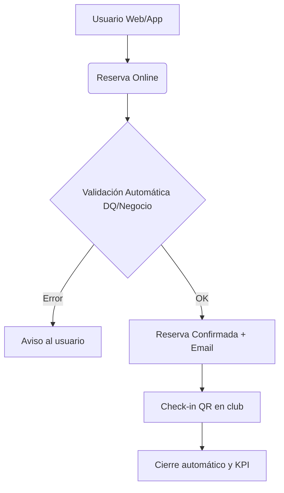

# Diagrama de Proceso To-Be y Quick Wins (Issue #16)

## 1. Proceso Optimizado (To-Be)

El nuevo flujo elimina la intervención manual y asegura la calidad del dato desde el inicio.

---

## 2. Identificación de Quick Wins (Ganancias Rápidas)

Los Quick Wins son mejoras de alto valor para el Club de Tenis que se pueden implementar con un esfuerzo relativamente bajo dentro del SIA. Se han identificado los siguientes:

---

### 1. Automatización de Notificaciones y Confirmaciones

**Problema actual:**  
El personal pierde tiempo confirmando reservas por teléfono o WhatsApp.

**Mejora:**  
Envío automático de correos electrónicos al cambiar el estado a "Reserva Confirmada".

**Impacto:**  
Ahorro aproximado de 10 horas semanales de gestión administrativa.

---

### 2. Validación Automática de Impagos

**Problema actual:**  
Se permiten reservas a usuarios que tienen deudas pendientes por falta de control centralizado.

**Mejora:**  
Bloqueo inmediato del botón "Reservar" si el perfil del socio tiene recibos pendientes.

**Impacto:**  
Reducción significativa de la morosidad y mejora del flujo de caja inmediato.

---

### 3. Autogestión de Niveles de Juego

**Problema actual:**  
Partidos desequilibrados que generan insatisfacción en los socios.

**Mejora:**  
Obligatoriedad de seleccionar un nivel (1, 2 o 3) en el registro para filtrar la búsqueda de compañeros.

**Impacto:**  
Mejora la experiencia del socio y la calidad del dato deportivo (DQ).

---

### 4. Visibilidad de Pistas Libres en Tiempo Real

**Problema actual:**  
El usuario no sabe si hay pistas disponibles hasta que lo consulta en recepción, lo que desincentiva el alquiler.

**Mejora:**  
Implementación de un panel público de lectura con los huecos disponibles (estado: Libre / Ocupado).

**Impacto:**  
Incremento estimado del 15% en el uso de pistas en horas valle.
