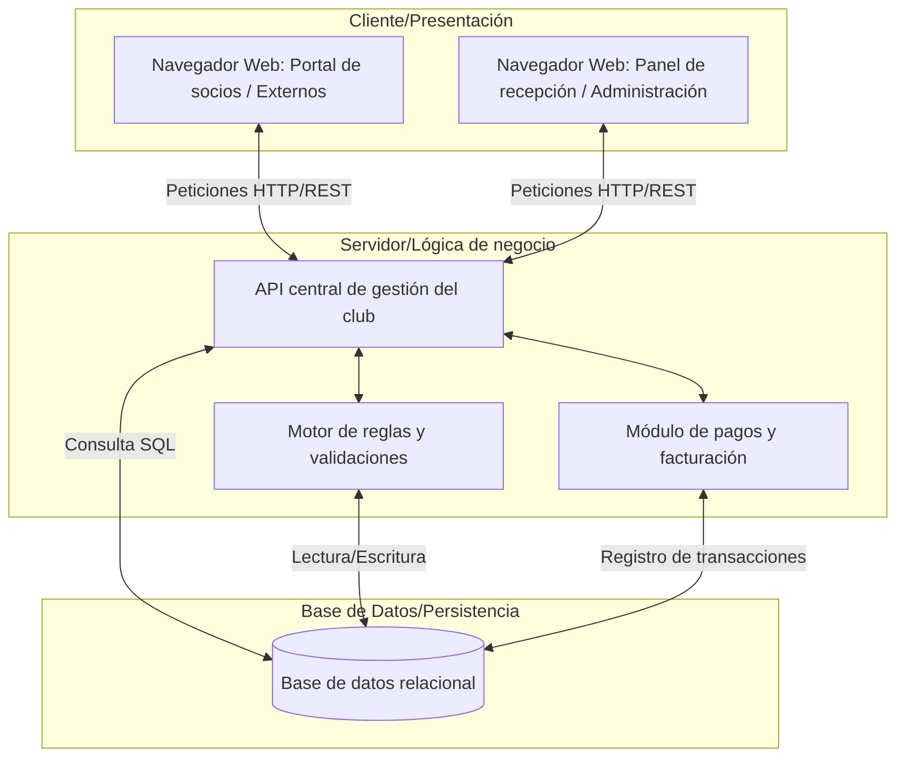

# Boceto de Arquitectura Conceptual Club de Tenis
Este documento preenta la visión inicial del Sistema de Información Automatizado (SIA) para el club de tenis.
Tal y como se establece en los requisitos del proyecto, el sistema se basa en tecnología Web utilizando una arquitectura clásica de cliente/servidor con persistencia de datos.

## 1. Diagrama de Arquitectura

## 2. Descripción de los Componentes

Para dar soporte tecnológico al proceso End-to-End (E2E) de reservas y facturación, el sistema se divide en las siguientes capas lógicas:

### Capa Cliente (Frontend)
Es la interfaz con la que interactúan los distintos actires del sistema:

* **Portal de socios / Externos:** aplicación web accesible desde cualquier navegador donde los clientes pueden consultar la disponibilidad de pistas, realizar reservar y gestionar su perfil.
* **Panel de recepción / Administracion:** interfaz web de uso interno para los empleados del club. Permite visualizar el panel de seguimiento de estados (reservas solicitadas, en uso, no-shows) y gestionar los cobros.

### Capa Servidor (Backend)
Es el "cerebro" del SIA, alojado en el servidor web. Procesa todas las peticiones que llegan desde las interfaces web:

* **API central de gestión:** recibe las solicitudes de los usuarios y coordina la respuesta.
* **Motor de reglas y validaciones:** se encarga de comprobar las reglas del negocio antes de confirmar una acción. Por ejemplo, verifica que el socio no tenga recibos pendientes, que no supere el límite de 2 reservas activas y que la pista no esté ya ocupada.
* **Módulo de pagos y facturación:** gestiona la lógica de fcturacción, procesa los cobros y aplica las penalizaciones correspondientes.

### Capa de la Base de datos
Es el componente encargado de la persistencia de la infromación en el servidor. Almacena de forma estructurada e interrelacionada:

* Datos de los usuarios (socios, externos, personal).
* Inventario de las instalaciones (pistas, tipos de superficie).
* Histórico completo de reservas y sus estados.
* Transacciones económicas y facturas.
