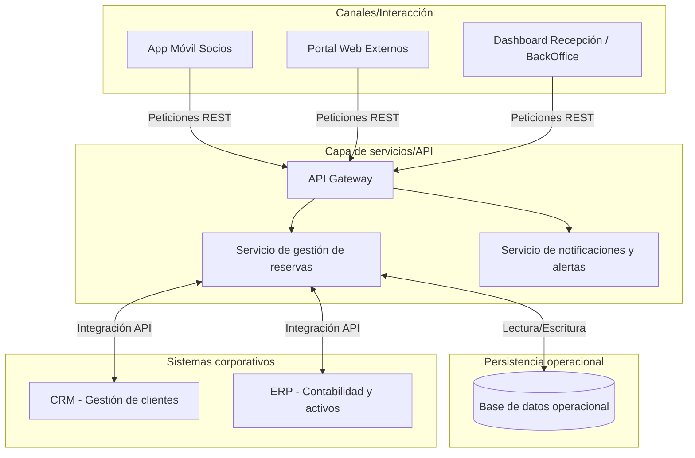

# Blueprint del Sistema de Información Automatizado (SIA)

Para dar soporte al proceso To-Be de gestión de reservas, la arquitectura evoluciona hacia un modelo de servicios integrados orientados a la automatización del Lead Time.

## 1. Esquema conceptual del blueprint

## 2. Descripción de componentes

1. **Canales/Cliente:** son los puntos de contacto. Incluyen una App Móvil para facilitar el autoservicio a los socios recurrentes, el portal web para externos, y el dashboard interno para que recepción gestione cobros pendientes y monitorice la ocupación en tiempo real.
2. **Servicios/API:**
   * **API Gateway:** punto único de entrada que enruta y asegura las peticiones (seguridad y control de acceso).
   * **Servicios de reservas:** motor lógico que ejecuta las validaciones (verificación de pagos pendientes y control de límite de reservas simultáneas).
   * **Servicio de notificaciones:** sistema automático para envío de emails/SMS mitigando el riesgo operativo de los altos índices de No-show.
3. **Persistencia:** base de datos relacional altamente disponible (Cloud) para procesar transacciones en tiempo real garantizando la unicidad de las reservas (evitando concurrencia).
4. **Integraciones:** conexión mediante APIs estandarizadas con los sistemas corporativos (CRM y ERP) para la gestión maestra de datos.
