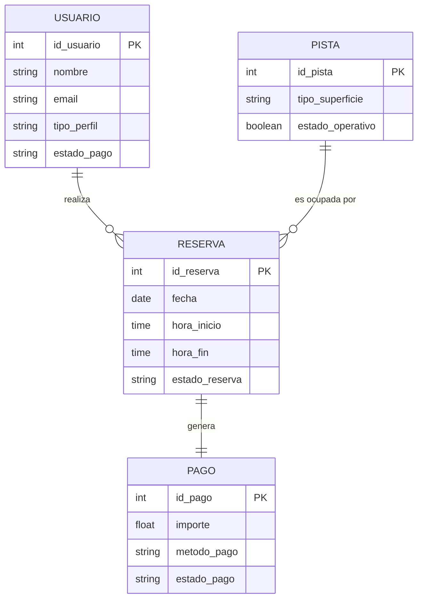

# Modelo ER y Datos Maestros

## 1. Modelo Entidad-Relación

## 2. Definición de Datos Maestros y System of Record

Para garantizar la fuente única de verdad (Single Source of Truth) y evitar discrepancias en la información, definimos los siguientes sistemas propietarios (SoR) y sus reglas de sincronización para cada dato maestro clave:

### Usuarios (Socios / Externos)
* **System of Record:** CRM (Customer Relationship Management).
* **Reglas de sincronización:** el CRM es el dueño principal de los datos del cliente Si el usuario actualiza su perfil en la web, el SIA envía la actualización al CRM vía API. Además, el SIA consulta el CRM en tiempo real para validar si el socio está al corriente de pago antes de permitirle hacer una reserva.

### Instalaciones (Pistas)
* **System of Record:** ERP (Módulo de activos e instalaciones).
* **Reglas de sincronización:** el ERP es el dueño del inventario físico. Existe una sincronización periódica hacia el SIA (por ejemplo, si una pista entra en mantenimiento, el ERP notifica al SIA para bloquear esa disponibilidad temporalmente en el calendario web).

### Transacciones (Pagos)
* **System of Record:** ERP (Módulo financiero / Contable).
* **Regla de sincronización:** aunque el SIA genera la intención de pago y gestiona la comunicación con la pasarela bancaria, el ERP es el dueño del estado contable final. Se sincroniza en tiempo real tras la confirmación del cobro para que el departamento de administración pueda cuadrar la caja.

### Reservas
* **System of Record:** SIA (Core del sistema de reservas).
* **Regla de sincronizción:** el SIA es el dueño operativo y transaccional de las reservas de pistas. Periódicamente, envía resúmenes al ERP para la facturación (calcular ingresos por franjas horarias) y al CRM para nutrit el historial de comportamiento y asistencia del cliente.0
  
